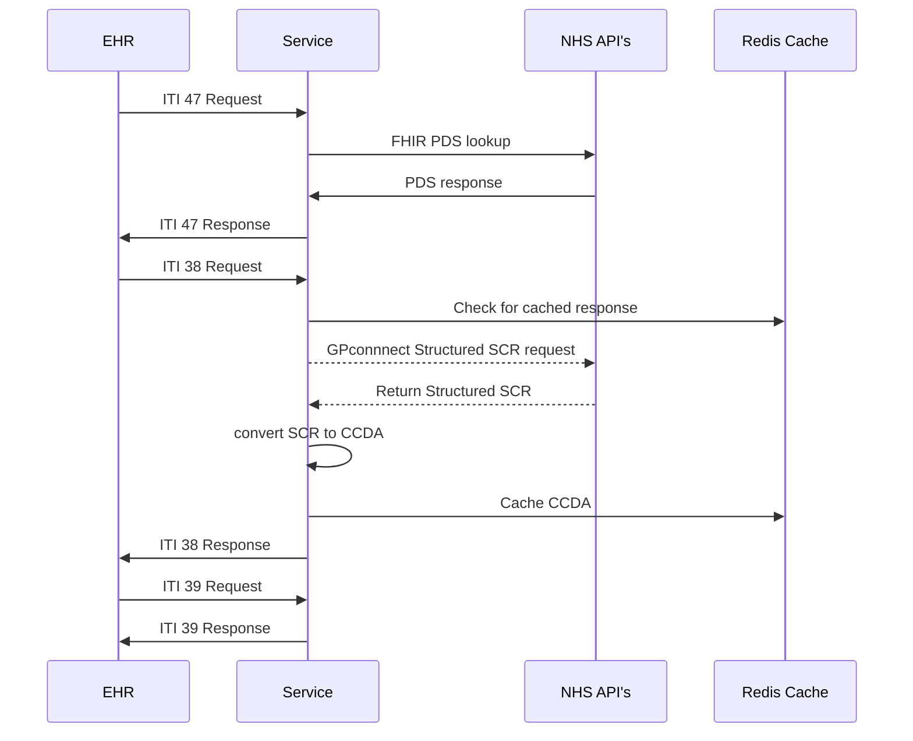

# GPConnect to CCDA service


---


This is a service to connect to GP Connect and return the structured SCR record as a CCDA document

---
## Overview

Current the service is designed to interact with a requesting EHR via ITI requests in order to lookup, request and convert a patients summary care record

---
## Tasks
Currently on open test environments only:
- [ ] ITI 47
- [ ] Fhir PDS lookup
- [x] ITI 38 call and response
- [x] GP Connect call
- [x] Fhir Bundle -> CCDA conversion
- [x] ITI 39 call and response

## Todo
- [ ] Flesh out html section of CCDA
- [ ] Progress to NHS test environment
- [ ] Sign up to PDS lookup

---
## Running

The project is built on fastAPI and pipenv for package management

to run locally
```
pipenv shell
pipenv install --dev
```
the project requires an active redis server running on port 6379
this should be activated first by running (for example)
```
redis-server /etc/redis/6379.conf
```
the server can then be started using
```
uvicorn app.main:app --reload
```

### Docker

The project can also be run using docker. Ensure you have a valid installation and simple run
```
docker-compose up
```
